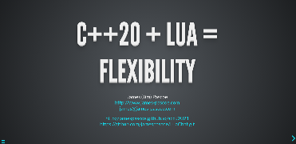

# C++20 + Lua = Flexibility

The image links below refer to [my](http://www.james-pascoe.com) upcoming presentation at
[ACCU 2021](https://flame.firebird.systems/archer-yates/ACCU2021/MyProgrammes#Entry.ItemPage.12122.0.EntryDefinition.b8efce33-2c84-4290-ba65-991a03ef305d)
and consists of a link to the online [presentation](http://jamespascoe.github.io/accu2021), a link
to the [LuaChat](http://github.com/jamespascoe/LuaChat.git) sample code and a link to the GitHub gist for
the SWIG [callback example](https://gist.github.com/jamespascoe/523a5cf4114a1230b4d8a386bb8cd8ba). Note
that the presentation is written using the excellent [Reveal.js](https://github.com/hakimel/reveal.js/)
framework.

